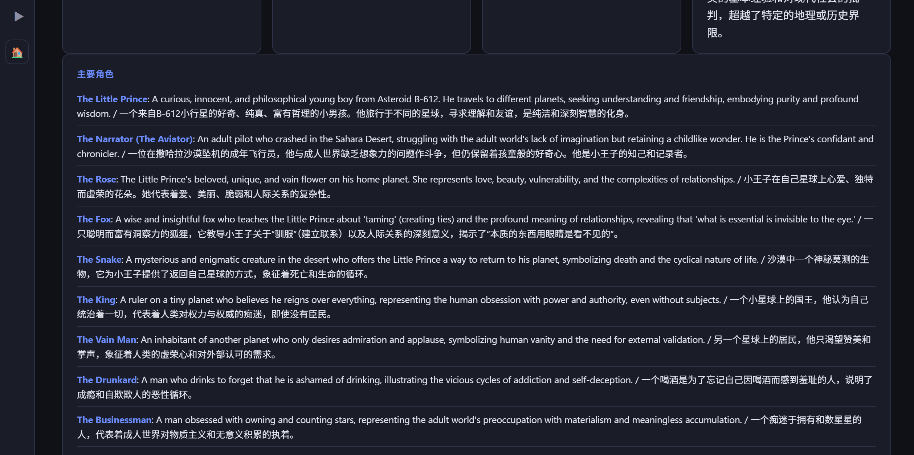
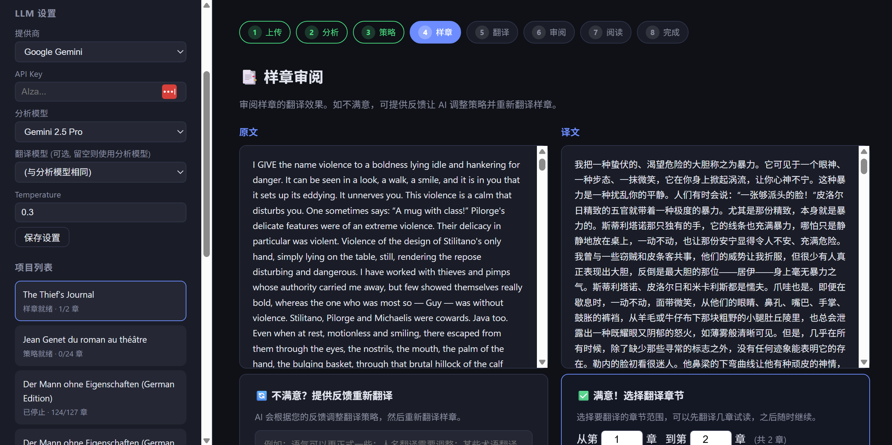
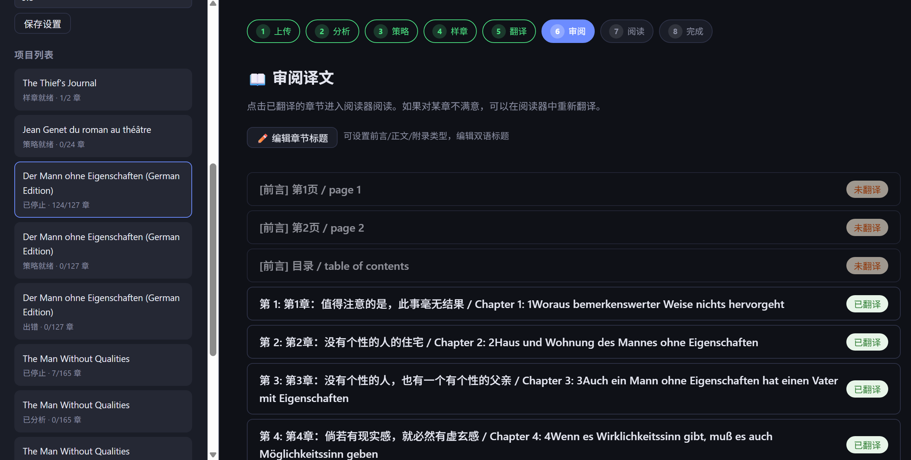
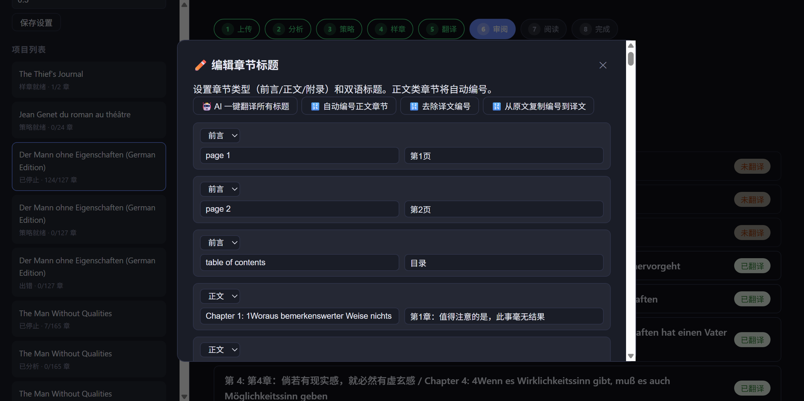
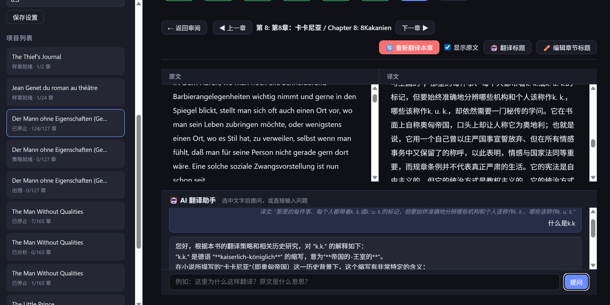
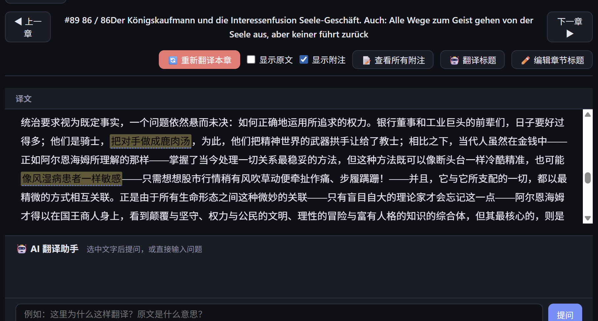
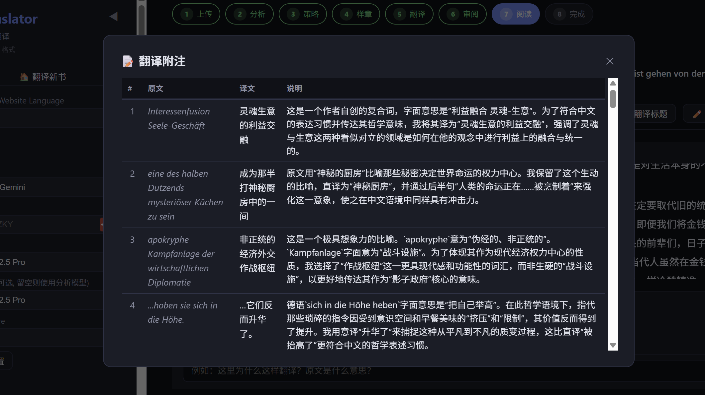
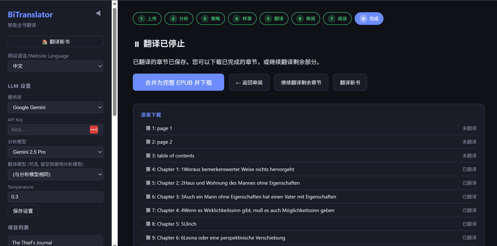

# BiTranslator – AI-Powered Full-Book Translation

**[English](#english) | [中文](#中文) | [Disclaimer / 免责声明](#disclaimer) | [更新日志 / Changelog](#changelog)**

---

<a id="english"></a>
## English

BiTranslator is an AI-driven whole-book translation tool that works with **EPUB files**. Unlike simple chapter-by-chapter machine translation, it mimics a professional translator's workflow: read the entire book first, understand the context, craft a translation strategy, then translate chapter by chapter — ensuring consistent terminology, coherent style, and contextual continuity throughout.

> **Supported format: EPUB only.** PDF, MOBI, and other formats are not supported. You can convert other formats to EPUB using tools like [Calibre](https://calibre-ebook.com/) before importing.

### Key Features

- **Deep Analysis** – AI reads the book and performs online research to identify genre, themes, characters, writing style, cultural context, etc.
- **Translation Strategy** – Automatically generates a translation strategy (glossary, character names, tone & style guidelines) with user feedback loops
- **User Control** – Edit the strategy, modify the glossary, specify character name translations, set the desired tone. Provide corrections at every step.
- **Translation Style Preference** – Choose between faithful translation or free translation that prioritizes readability for complex sentences
- **Translator's Annotations** – AI generates explanatory notes for difficult sentences, idioms, and cultural references alongside translation; viewable inline or in a dedicated panel; exportable as a standalone EPUB
- **Annotation Density Control** – Choose between verbose (8–15 notes/chunk), normal (3–8), or minimal (1–3) annotation density to match your reading preference
- **Sample Review** – Translates a sample chapter for preview; refine the strategy based on your feedback before full translation
- **Chapter Range Selection** – Choose which chapters to translate (e.g., chapters 3–10); save strategy and continue later
- **Context Continuity** – Carries forward summaries of previous chapters during translation to maintain consistency
- **EPUB Reader** – Built-in reader with side-by-side original/translation view, AI Q&A, and title editing
- **Immersive Reading Mode** – Fullscreen distraction-free reading; desktop: Photoshop-style icon sidebar that expands on hover; mobile: floating menu button with bottom toolbar; AI Q&A as a floating chat widget
- **Bilingual Titles** – Chapter titles displayed in both source and target languages in the editor and generated EPUBs
- **Chapter Type Management** – Mark chapters as front matter, body chapters, or back matter; body chapters are auto-numbered
- **Parallel Translation** – Multiple text chunks are translated concurrently within each chapter, dramatically speeding up translation
- **Retranslation with Feedback** – Retranslate individual chapters with specific feedback; optionally override annotation/style options per chapter; strategy automatically updated based on feedback
- **Version Control** – Full version history for both translations and strategies; compare versions side-by-side, preview strategy versions before applying, and revert to any previous version
- **Strategy Templates** – Save translation strategies as reusable templates; apply them to new projects for quick setup
- **EPUB Output** – Chapter-by-chapter EPUB output with stop/resume, individual downloads, and combined full-book EPUB with configurable appendices (annotations, Q&A, highlights)
- **Project Export/Import** – Export an entire project (analysis, strategy, translations, annotations, Q&A, highlights) as a single JSON file; share it with others who can import and browse in their own instance
- **Persistent AI Q&A** – All reader Q&A conversations are saved and restored across sessions; downloadable as an EPUB appendix
- **Highlights & Notes** – Highlight text and add personal notes directly in the reader; exportable as standalone EPUB or Markdown
- **Multi-Model Support** – Google Gemini (native SDK), OpenAI, DeepSeek, Ollama (local), and any OpenAI-compatible API
- **Bilingual UI** – Interface available in Chinese and English

### Workflow

```
Upload EPUB → Deep Analysis (with online research) → Generate Strategy → Edit Strategy
→ Translate Sample → Review/Feedback → Full Translation → Reader & Review
→ Immersive Reading → Download EPUB (with optional appendices)
```

### Screenshots

**Deep Analysis** – AI identifies genre, themes, characters, writing style, and cultural context with bilingual output:





**Sample Review** – Preview translation quality with side-by-side original/translation; select chapter range for full translation:



**Review** – Browse all chapters, manage chapter types and bilingual titles:



**Title Editor** – Set chapter types (front matter/body/back matter), edit bilingual titles, auto-number, AI translate:



**Built-in Reader** – Side-by-side reading with AI Q&A assistant for translation questions:



**Translator's Annotations** – Annotated sentences highlighted in translation; click to view the note inline:




**All Annotations Panel** – View all translator's notes for the current chapter at once:



**Download** – Chapter-by-chapter downloads or combine into a complete translated EPUB:



### Quick Start

#### 1. Prerequisites

Requires Python 3.10+.

```bash
cd bitranslator
pip install -r requirements.txt
```

#### 2. Configuration

Copy the environment variable template and fill in your API details:

```bash
cp .env.example .env
# Edit .env and fill in your API Key, etc.
```

You can also configure LLM settings through the sidebar in the web UI after launching.

#### 3. Launch

```bash
python run.py
```

Open http://127.0.0.1:8000 in your browser.

#### 4. Usage

1. **Upload** – Select an EPUB file, set the target language (source auto-detected)
2. **Analysis** – AI analyzes the book with online research (may take a few minutes); provide feedback to re-analyze
3. **Strategy** – Review and customize the translation strategy; provide feedback to regenerate; save versions and templates
4. **Sample** – Select a sample chapter and review translation quality; iterate as needed
5. **Translate** – Select chapter range and start translating; stop/resume anytime
6. **Review** – Read chapters in the built-in reader; re-translate individual chapters with feedback; compare translation versions
7. **Immersive Mode** – Enter fullscreen distraction-free reading with AI Q&A, annotations, and highlights
8. **Download** – Download individual chapter EPUBs or combine into a full book with optional appendices

### Supported LLMs

| Provider | Configuration |
|----------|---------------|
| Google Gemini | Select "Google Gemini" provider, enter your API Key (default: gemini-2.5-pro) |
| OpenAI | Select "OpenAI / Compatible API", Base URL: `https://api.openai.com/v1` |
| DeepSeek | Select "OpenAI / Compatible API", Base URL: `https://api.deepseek.com/v1` |
| Ollama (local) | Select "Ollama", Base URL: `http://localhost:11434/v1` |
| Other | Enter any OpenAI-compatible Base URL and API Key |

### Project Structure

```
bitranslator/
├── backend/
│   ├── app.py              # FastAPI application
│   ├── config.py           # Configuration management
│   ├── database.py         # SQLite database (with auto-migration)
│   ├── models.py           # Pydantic data models
│   ├── routers/
│   │   ├── books.py        # Project/book management API
│   │   └── translation.py  # Analysis/strategy/translation API
│   └── services/
│       ├── llm_service.py          # LLM client (Gemini native + OpenAI)
│       ├── epub_service.py         # EPUB parsing & building
│       ├── analysis_service.py     # Book deep analysis with online research
│       ├── strategy_service.py     # Translation strategy generation
│       ├── translation_service.py  # Translation engine with auto-continuation
│       └── name_data.py            # Common name database for name detection
├── frontend/
│   ├── index.html          # UI
│   ├── style.css           # Styles (responsive, dark/light themes)
│   ├── app.js              # Entry point & hash-based routing
│   └── modules/
│       ├── state.js        # Shared application state
│       ├── core.js         # Core utilities & panel switching
│       ├── i18n.js         # Internationalization (zh/en)
│       ├── settings.js     # LLM settings sidebar
│       ├── upload.js       # File upload
│       ├── analysis.js     # Deep analysis panel
│       ├── strategy.js     # Strategy editor & version control
│       ├── sample.js       # Sample translation
│       ├── translate.js    # Full translation progress
│       ├── review.js       # Chapter review panel
│       ├── titles.js       # Chapter title management
│       └── reader.js       # EPUB reader & immersive mode
├── data/                   # Runtime data (uploads, database)
├── output/                 # Translated EPUB output
├── requirements.txt
├── run.py                  # Entry point
└── .env.example            # Environment variable template
```

---

<a id="中文"></a>
## 中文

BiTranslator 是一款 AI 驱动的整书翻译工具，支持 **EPUB 格式**。不同于简单的逐章机器翻译，它模拟专业译者的工作流程：先通读全书、理解上下文、制定翻译策略，再逐章翻译——确保术语一致、风格连贯、上下文通顺。

> **仅支持 EPUB 格式。** 不支持 PDF、MOBI 等其他格式。可使用 [Calibre](https://calibre-ebook.com/) 等工具将其他格式转换为 EPUB 后再导入。

### 主要功能

- **深度分析** – AI 阅读书籍并进行在线调研，识别体裁、主题、角色、写作风格、文化背景等
- **翻译策略** – 自动生成翻译策略（术语表、角色名称、语气风格指南），支持用户反馈迭代
- **用户控制** – 可编辑策略、修改术语表、指定角色名翻译、设定语气。每个步骤都可以提供修正意见
- **翻译风格偏好** – 可选择忠实原文翻译或优先可读性的意译模式，针对长难句自动拆分重组
- **翻译附注** – AI 翻译时同步生成长难句、惯用语、文化背景的意译分析注释；可在阅读器内高亮查看或弹窗浏览全部附注；支持导出为独立 EPUB
- **附注密度控制** – 可选择详尽（每段 8–15 条）、适中（3–8 条）或精简（1–3 条）三种附注密度，满足不同阅读习惯
- **样章审阅** – 翻译样章供预览；根据反馈调整策略后可重新翻译
- **章节范围选择** – 选择翻译特定章节（如第3-10章）；保存策略后可随时继续
- **上下文连贯** – 翻译时携带前面章节的摘要，保持情节和术语一致性
- **EPUB 阅读器** – 内置阅读器，支持原文/译文对照阅读、AI 问答、标题编辑
- **沉浸式阅读** – 全屏无干扰阅读模式；电脑端：Photoshop 式图标侧边栏，鼠标悬停展开；手机端：浮动菜单按钮搭配底部工具栏；AI 问答变为浮动聊天窗口
- **双语标题** – 章节标题在编辑器和生成的 EPUB 中以原文/译文双语显示
- **章节类型管理** – 可将章节标记为前言、正文或附录；正文章节自动编号
- **并行翻译** – 每章内多个文本块同时发送翻译请求，大幅提升翻译速度
- **带反馈的重新翻译** – 可针对单章提交具体反馈重新翻译；可单独覆盖标注/风格选项；策略根据反馈自动更新
- **版本控制** – 译文和翻译策略均有完整版本历史；可并排对比版本、预览策略版本详情后再应用、回溯到任意历史版本
- **策略模板** – 可将翻译策略保存为可复用模板；新项目可一键应用模板快速启动
- **EPUB 输出** – 逐章输出 EPUB，支持停止/恢复、单章下载、合并为完整译本（可配置附录：附注、问答、划线笔记）
- **项目导出/导入** – 将完整项目（分析、策略、译文、附注、问答、划线笔记）导出为 JSON 文件；可分享给他人在其本地实例中导入浏览
- **AI 问答保存** – 阅读器内的所有 AI 问答对话自动保存，跨会话恢复；可下载为 EPUB 附录
- **划线与笔记** – 在阅读器内直接划线和添加个人批注；可导出为独立 EPUB 或 Markdown
- **多模型支持** – Google Gemini（原生 SDK）、OpenAI、DeepSeek、Ollama（本地模型）及任意 OpenAI 兼容 API
- **双语界面** – 支持中文和英文界面切换

### 工作流程

```
上传 EPUB → 深度分析（含在线调研）→ 生成翻译策略 → 编辑策略
→ 翻译样章 → 审阅/反馈 → 全书翻译 → 阅读器审阅
→ 沉浸式阅读 → 下载 EPUB（可选附录）
```

### 界面截图

**深度分析** – AI 识别体裁、主题、角色、写作风格和文化背景，中英双语输出：


**样章审阅** – 原文/译文对照预览翻译质量；选择章节范围进行全书翻译：


**审阅** – 浏览所有章节，管理章节类型和双语标题：


**标题编辑器** – 设置章节类型（前言/正文/附录），编辑双语标题，自动编号，AI 翻译：


**内置阅读器** – 原文/译文对照阅读，AI 翻译助手随时解答翻译疑问：


**翻译附注** – 有注释的译文句子高亮显示，点击即可查看该句注释：


**全部附注面板** – 一次查看当前章节的所有翻译注释：


**下载** – 逐章下载或合并为完整译本 EPUB：


### 快速开始

#### 1. 环境要求

需要 Python 3.10+。

```bash
cd bitranslator
pip install -r requirements.txt
```

#### 2. 配置

复制环境变量模板并填入 API 信息：

```bash
cp .env.example .env
# 编辑 .env 文件，填入你的 API Key 等信息
```

也可以在启动后通过网页侧边栏配置 LLM 设置。

#### 3. 启动

```bash
python run.py
```

在浏览器中打开 http://127.0.0.1:8000。

#### 4. 使用方法

1. **上传** – 选择 EPUB 文件，设置目标语言（源语言自动检测）
2. **分析** – AI 分析书籍并进行在线调研（可能需要几分钟）；可提交反馈重新分析
3. **策略** – 审阅并自定义翻译策略；可提交反馈重新生成；保存版本和模板
4. **样章** – 选择样章并审阅翻译质量；可反复调整
5. **翻译** – 选择章节范围开始翻译；随时可停止/恢复
6. **审阅** – 在内置阅读器中阅读；可对单章提交反馈重新翻译；对比不同译文版本
7. **沉浸阅读** – 进入全屏无干扰阅读，配合 AI 问答、附注和划线笔记
8. **下载** – 下载单章 EPUB 或合并为完整译本（可选附录）

### 支持的 LLM

| 提供商 | 配置方式 |
|--------|----------|
| Google Gemini | 选择"Google Gemini"提供商，输入 API Key（默认：gemini-2.5-pro） |
| OpenAI | 选择"OpenAI / 兼容 API"，Base URL: `https://api.openai.com/v1` |
| DeepSeek | 选择"OpenAI / 兼容 API"，Base URL: `https://api.deepseek.com/v1` |
| Ollama（本地）| 选择"Ollama"，Base URL: `http://localhost:11434/v1` |
| 其他 | 输入任意 OpenAI 兼容的 Base URL 和 API Key |

### 项目结构

```
bitranslator/
├── backend/
│   ├── app.py              # FastAPI 应用
│   ├── config.py           # 配置管理
│   ├── database.py         # SQLite 数据库（含自动迁移）
│   ├── models.py           # Pydantic 数据模型
│   ├── routers/
│   │   ├── books.py        # 项目/书籍管理 API
│   │   └── translation.py  # 分析/策略/翻译 API
│   └── services/
│       ├── llm_service.py          # LLM 客户端（Gemini 原生 + OpenAI）
│       ├── epub_service.py         # EPUB 解析与构建
│       ├── analysis_service.py     # 书籍深度分析（含在线调研）
│       ├── strategy_service.py     # 翻译策略生成
│       ├── translation_service.py  # 翻译引擎（含自动续写）
│       └── name_data.py            # 常见姓名数据库（用于人名检测）
├── frontend/
│   ├── index.html          # 用户界面
│   ├── style.css           # 样式（响应式、明/暗主题）
│   ├── app.js              # 入口与哈希路由
│   └── modules/
│       ├── state.js        # 共享应用状态
│       ├── core.js         # 核心工具与面板切换
│       ├── i18n.js         # 国际化（中/英）
│       ├── settings.js     # LLM 设置侧边栏
│       ├── upload.js       # 文件上传
│       ├── analysis.js     # 深度分析面板
│       ├── strategy.js     # 策略编辑器与版本控制
│       ├── sample.js       # 样章翻译
│       ├── translate.js    # 全书翻译进度
│       ├── review.js       # 章节审阅面板
│       ├── titles.js       # 章节标题管理
│       └── reader.js       # EPUB 阅读器与沉浸模式
├── data/                   # 运行时数据（上传文件、数据库）
├── output/                 # 翻译输出的 EPUB
├── requirements.txt
├── run.py                  # 启动入口
└── .env.example            # 环境变量模板
```

### 技术细节

#### 翻译上下文连贯性

系统通过以下机制确保跨章节一致性：

1. **全书分析** – 为每章生成摘要，再结合在线调研产出全书整体分析
2. **统一翻译策略** – 术语表和角色名映射在所有章节中统一应用
3. **滚动上下文** – 翻译每章时，携带前面章节的摘要作为上下文
4. **长章节拆分** – 过长章节自动在段落边界拆分翻译，并支持截断检测和自动续写

#### 版本控制

- 翻译策略和章节译文均支持完整版本历史
- 策略版本可预览详情后再决定是否应用，也可保存为跨项目的模板
- 用户提交重新翻译反馈时，策略自动更新并生成新版本
- 每次重新翻译都会保存当前译文为历史版本，便于回溯

#### 数据存储

所有数据存储在本地：
- SQLite 数据库存储项目信息、章节内容、分析结果、翻译策略、版本历史、人名表、问答记录和划线笔记
- 上传的 EPUB 和翻译后的 EPUB 存储在各项目子目录中

---

<a id="disclaimer"></a>
## 免责声明 / Disclaimer

在使用 BiTranslator（以下简称"本工具"）之前，请务必仔细阅读并理解本声明。使用本工具即表示您已同意以下条款。
Please read and understand this statement carefully before using BiTranslator (hereinafter referred to as the "Tool"). By using this Tool, you agree to the following terms.

### 1. 版权与合法使用 / Copyright and Legal Use

**版权声明 / Copyright Statement**：本工具仅作为一个技术辅助工具，用于帮助用户进行语言翻译学习和研究。本工具本身不提供任何电子书资源。
This Tool is provided solely as a technical aid for language translation, learning, and research. The Tool itself does not provide any e-book resources.

**用户责任 / User Responsibility**：用户在使用本工具翻译书籍时，必须确保其行为符合当地版权法。用户应仅对拥有合法版权或已获得授权的书籍进行翻译。
Users must ensure their actions comply with local copyright laws when using this Tool. Users should only translate books for which they hold the legal copyright or have obtained proper authorization.

**个人用途 / Personal Use**：建议本工具仅用于个人学习、研究和欣赏。因用户非法传播、分发受版权保护的译文而产生的任何法律纠纷，由用户本人承担，本工具作者不承担任何法律责任。
It is recommended that this Tool be used only for personal learning, research, and appreciation. Any legal disputes arising from the illegal dissemination or distribution of copyrighted translations shall be the sole responsibility of the user; the author of this Tool assumes no legal liability.

### 2. AI 翻译内容的准确性 / Accuracy of AI-Generated Content

**技术限制 / Technical Limitations**：本工具生成的翻译内容及分析报告由第三方大语言模型（如 Google Gemini）生成。尽管本工具通过调研策略优化了翻译质量，但 AI 仍可能产生逻辑错误、事实错误或不恰当的表达。
The translations and analysis reports generated by this Tool are produced by third-party Large Language Models (e.g., Google Gemini). Although the Tool optimizes quality through research strategies, AI may still produce logical errors, factual inaccuracies, or inappropriate expressions.

**内容审核 / Content Review**：翻译结果仅供参考，不代表作者观点。用户应对 AI 生成的内容进行最终审核，作者不对翻译结果的准确性、完整性或适用性作任何明示或暗示的保证。
Translation results are for reference only and do not represent the author's views. Users are responsible for the final review of AI-generated content. The author makes no warranties, express or implied, regarding the accuracy, completeness, or suitability of the results.

### 3. API 调用与计费 / API Calls and Billing

**API Key 安全 / API Key Security**：本工具要求用户输入自己的第三方 API Key。该 Key 仅存储于用户本地环境，作者无法获取您的私钥。请妥善保管您的 API Key，防止泄露。
This Tool requires users to input their own third-party API Keys. These keys are stored only in the user's local environment; the author cannot access your private keys. Please keep your API Key secure to prevent leaks.

**费用承担 / Cost Responsibility**：使用本工具产生的 AI 模型调用费用由用户自行承担。由于 AI 消耗 Token 较快，建议用户在使用前了解相关平台的计费规则。作者不对因使用本工具导致的任何 API 账单费用负责。
Users are solely responsible for any AI model invocation costs incurred while using this Tool. As AI consumes tokens rapidly, users are advised to understand the billing rules of the relevant platforms beforehand. The author is not responsible for any API billing charges resulting from the use of this Tool.

### 4. 隐私与数据处理 / Privacy and Data Processing

**本地运行 / Local Operation**：本工具优先在本地处理数据。除非用户主动配置，否则书籍内容不会被上传至作者的服务器。
This Tool prioritizes processing data locally. Unless actively configured by the user, book content will not be uploaded to the author's servers.

**第三方隐私 / Third-Party Privacy**：书籍内容会发送至用户配置的 AI 服务提供商（如 Google）。请查阅相关厂商的隐私政策以了解他们如何处理您的数据。
Book content will be sent to the AI service provider configured by the user (e.g., Google). Please refer to the respective provider's privacy policy to understand how they handle your data.

### 5. 责任限制 / Limitation of Liability

**无担保 / No Warranty**：在适用法律允许的最大范围内，本工具按"现状"提供，不附带任何形式的担保。
To the maximum extent permitted by applicable law, this Tool is provided "as is" without warranties of any kind.

**损失赔偿 / Damages**：在任何情况下，作者均不对因使用或无法使用本工具而产生的任何直接、间接、偶然或特殊的损害（包括但不限于利润损失、数据丢失或业务中断）承担责任。
In no event shall the author be liable for any direct, indirect, incidental, or special damages (including but not limited to loss of profits, data loss, or business interruption) arising out of the use or inability to use this Tool.

本声明的最终解释权归 BiTranslator 项目作者所有。
The final right of interpretation of this statement belongs to the author of the BiTranslator project.

---

<a id="changelog"></a>
## 更新日志 / Changelog

#### 2026-02-26

| 类型 | 内容 |
|------|------|
| feat | **Retranslation with feedback**: retranslate chapters with specific feedback; override annotation/style options per chapter; strategy auto-updates / **带反馈的重新翻译**：单章重新翻译时可提交具体反馈，可单独覆盖标注和风格选项，策略自动更新 |
| feat | **Translation version control**: full version history for chapter translations; compare versions side-by-side; restore any previous version / **译文版本控制**：章节译文完整版本历史，可并排对比，可恢复任意历史版本 |
| feat | **Strategy version control**: full version history for translation strategies with preview before applying; linked to translation versions / **策略版本控制**：翻译策略完整版本历史，可预览详情后再应用，与译文版本关联 |
| feat | **Strategy templates**: save strategies as reusable templates; apply to new projects / **策略模板**：将翻译策略保存为可复用模板，新项目可一键应用 |
| feat | **Annotation density control**: choose verbose (8–15 notes), normal (3–8), or minimal (1–3) annotation density / **附注密度控制**：可选详尽、适中、精简三档附注密度 |
| feat | **Immersive reading mode**: fullscreen distraction-free reader; desktop: Photoshop-style icon sidebar expanding on hover; mobile: floating menu with bottom toolbar; AI Q&A as floating chat widget / **沉浸式阅读**：全屏无干扰阅读，电脑端图标侧边栏悬停展开，手机端浮动菜单底部工具栏，AI 问答浮动窗口 |
| feat | **Combined EPUB options panel**: configure appendices (annotations placement, highlights, Q&A) when downloading full book / **合并下载选项面板**：下载全书时可配置附录内容（附注位置、划线笔记、问答） |
| feat | **Highlights export formats**: export highlights as EPUB or Markdown / **划线笔记导出格式**：支持导出为 EPUB 或 Markdown |


#### 2026-02-25

| 类型 | 内容 |
|------|------|
| feat | **Parallel translation**: translate multiple chunks concurrently within each chapter for dramatically faster translation speed / **并行翻译**：每章内多个文本块并发翻译，大幅提升翻译速度 |
| feat | **Project export/import**: export entire project (analysis, strategy, translations, annotations, Q&A, highlights) as JSON; import on any instance / **项目导出/导入**：将完整项目导出为 JSON 文件，可在任意实例导入浏览 |
| feat | **Persistent AI Q&A**: reader Q&A conversations are saved to database and restored across sessions; downloadable as EPUB / **AI 问答保存**：阅读器问答自动保存至数据库，跨会话恢复，可导出为 EPUB |
| feat | **Highlights & notes**: highlight text and add personal notes in the reader; exportable as standalone EPUB / **划线与笔记**：在阅读器内划线和添加批注，可导出为独立 EPUB |

#### 2026-02-24

| 类型 | 内容 |
|------|------|
| feat | **Translator's annotations**: AI generates explanatory notes for difficult sentences, idioms, and cultural references alongside each translation chunk / **翻译附注**：AI 在翻译时同步生成长难句、惯用语、文化背景的意译分析注释 |
| feat | **Inline annotation highlights**: toggle "Show Annotations" to highlight annotated sentences in the translation; click to view the note in a tooltip at the bottom / **内联附注高亮**：勾选"显示附注"可在译文中高亮有注释的句子，点击后在底部显示该句注释 |
| feat | **All annotations panel**: click "View All Notes" to open a modal showing all annotations for the current chapter / **全部附注面板**：点击"查看所有附注"弹窗显示当前章节的全部注释 |
| feat | **Annotations EPUB export**: download all translator's notes as a standalone EPUB / **附注 EPUB 导出**：可将全部翻译注释下载为独立 EPUB |
| feat | **Free-translation preference**: new strategy option to prioritize readability — restructure long/complex sentences for clarity / **意译偏好选项**：新增翻译策略选项，优先可读性，长难句自动拆分重组 |
| fix | Fix annotation tooltip text color invisible in dark theme / 修复暗色主题下附注提示框文字不可见的问题 |

#### 2026-02-22

| 类型 | 内容 |
|------|------|
| fix | Resolve API key input recognition issue / 修复 API Key 输入识别问题 |
| refactor | Reorganize frontend structure and introduce `modules/` directory / 重构前端结构，新增 `modules/` 目录 |
| feat | Add routing to enable direct navigation to specific books and pages / 增加路由，支持直接跳转到指定项目和页面 |
| feat | Introduce subpages with back navigation support / 支持子页面及返回导航 |
| feat | Support multi-part book structures (e.g., Part I, Part II) in addition to chapters / 支持多“部”结构（如第一部、第二部）以及普通章节 |
| feat | Refine annotation rules: only annotate terms/places without standard translations; names annotated once per request with selective coverage / 细化标注规则：仅标注无通用译名的术语/地名；人名每请求一次且选择性标注 |
| feat | Allow users to edit character names and unify translated character names / 支持用户编辑角色名并统一译文中的人名 |

